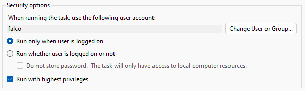
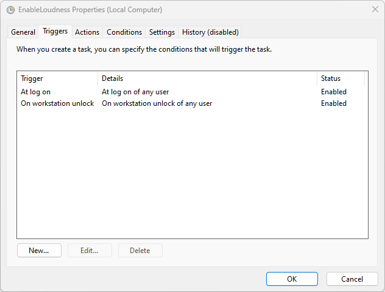
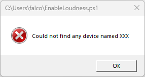

# Enable Loudness Equalisation
Automatically adds and enables loudness equalisation to any playback device

| before execution | after execution |
| --------------- | -------------- |
|   |   |

# How to Download and Run
run in powershell
```
Invoke-WebRequest https://raw.githubusercontent.com/Falcosc/enable-loudness-equalisation/main/EnableLoudness.ps1 -OutFile $env:HOMEPATH\EnableLoudness.ps1
Set-ExecutionPolicy -ExecutionPolicy RemoteSigned -Scope CurrentUser
. $env:HOMEPATH\EnableLoudness.ps1
```
# When is it needed?
- HDMI or Display Port Playback devices usually doesn't have it
- if you can not find audio driver version which adds loudness equalisation to any of your playback devices
- you can't enable it globally in your driver

# Why does it need to be scripted?
- if you want to toggle it via hotkey
- updates are messing with your audio drivers
- some use cases lead into re-registration of your HDMI or DisplayPort playback devices, which will purge your settings every time

# What does it do?
1. search for all active playback devices by name in registry
1. imports audio enhancement settings and sets loudness equalisation flag
1. restarts audio service to apply changed registry values

# Known Issues
- all setting flags stored in `fc52a749-4be9-4510-896e-966ba6525980` get overwritten, instead of just enabling loudness equalisation
- flags key are different across Windows versions `fc52a749-4be9-4510-896e-966ba6525980` used in this script works for Windows 11, maybe 10 as well.
- If the playback device gets re-detected the audio service reboot maybe sets volume to default 100%
- Sound Settings UI shows 0% volume if it was open during restart (reopening fixes it)

# Install as Task
1. Open Task Scheduler
1. Action -> Create Task...
1. General -> Run with highest privileges
  
    
1. Triggers -> New...
  
    
1. Actions -> New...
    - Action: Start a program
    - Program: powershell
    - Add arguments: `-WindowStyle hidden -f %HOMEPATH%\EnableLoudness.ps1 -playbackDeviceName BE279`
1. To test it you could use an invalid DeviceName like "-playbackDeviceName XXX" then you will see an error message pop-up after login
  
    
