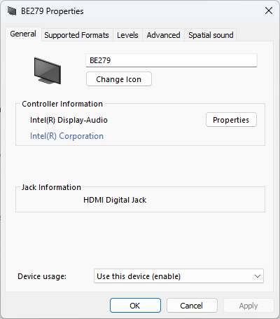
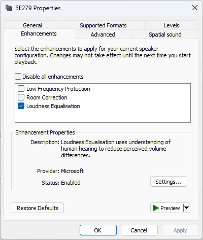

# Enable Loudness Equalisation
Automatically adds and enables loudness equalisation to any playback device

| before execution | after execution |
| --------------- | -------------- |
|   |   |

# How to Run
one time run as admin in powershell
```
EnableLoudness.ps1 -playbackDeviceName <name of your playback device>
```
Reusable shortcut
1. target: `powershell.exe -f EnableLoudness.ps1 -playbackDeviceName <name of your playback device>`
2. advanced: run as admin

# When is it needed?
- HDMI or Display Port Playback devices usually doesn't have it
- if you can not find audio driver version which adds loudness equalisation to any of your playback devices
- you can't enable it globally in your driver

# Why does it need to be scripted?
- if you want to toggle it via hotkey
- updates are messing with your audio drivers
- some use cases lead into re-registration of your HDMI or DisplayPort playback devices, which will purge your settings every time

# What does it do?
1. search for all playback devices by name in registry
1. imports audio enhancement settings and sets loudness equalisation flag
1. restarts audio service to apply changed registry values

# Known Issues
- all settings flags stored in `fc52a749-4be9-4510-896e-966ba6525980` get overwritten with, instead of just enabling loudness equalisation
- flags key is different across Windows version `fc52a749-4be9-4510-896e-966ba6525980` used in this script works for Windows 11, maybe 10 as well.
